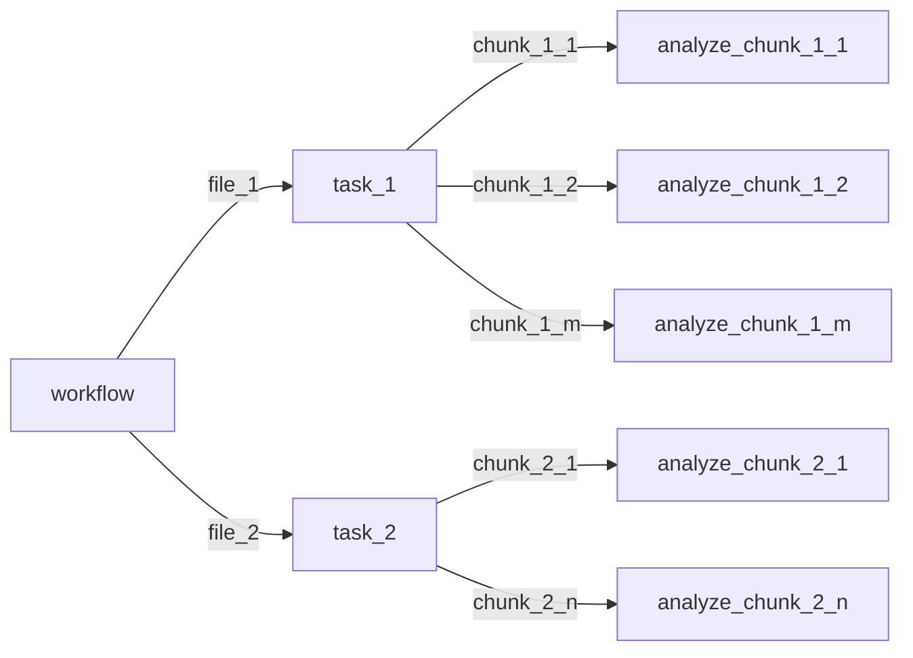

# Developing an analysis

In mammoth, there is an analysis framework which can be applied to track skims. This framework provides steering, input/output, generators, tools, and analysis functionality. This means that you can focus on your analysis! However, for all of these pieces to work together, it's important that you follow some conventions.

# Core concepts

First, we'll start with the core concepts in the framework

## Analysis code

The name is self explanatory - it contains the main analysis code. You do your actual analysis implementation here on some provided array!

Notes:

- The array may be an entire file or a chunk of a file (ie. a part of a file), or many files. The point of the array interface is that your analysis doesn't need to care how you're getting the data - it can just analyze what is provided.
- Sometimes described in the context of analyzing a chunk to emphasize that we're talking about the analysis code rather than the overall physics analysis (eg. a complete analysis including systematic uncertainties)

## Framework task

This represents one task in an overall workflow (see "calculation" in the next bullet), where the task commonly will **wrap around the analysis code above**. The task level takes care of all of the input/output, chunking, steering, etc.

Notes:

- In many analyses, you don't need to worry about this at all because it will only be used internally - it's just useful to be aware of the concept.
- In `parsl` terminology, this corresponds to an "app".
- It's sometimes called an "analysis task", but this usage is discouraged to avoid confusion!
  - It's one step up the chain from the above analysis code
- If the occasion arises, you can define more tasks. However, there are costs to eg. passing large objects between jobs (it may or may not even be possible), so a good convention is to make an analysis code one task

> [!tip]
> This is one level up from the analysis code

## Workflow

- A list of tasks to be completed for a full analysis, defining a dependency tree. For the analysis framework, you'll usually only add one task - the task wrapping your analysis code. (However, additional tasks are sometimes added by the analysis framework, as needed).
- Sometimes this can also be referred to as a **"Job"** or **"Calculation"**
- A workflow often has multiple files to process, so it will run the task over each file to complete the job

> [!tip]
> This is one level up from the tasks. A workflow may contain many tasks

## Production

- This is an instance of a workflow (ie. where we got actually run the calculation) with a particular dataset. The production has concrete outputs, which we define and keep track of in the yaml file.

> [!example]
> Running a substructure job over a pythia dataset would be one production.

# Implementation

With these concepts in mind, we'll go through how to implement these components in your analysis:

- [Analysis code](#analysis-code): This contains the main analysis code. You do your actual implementation here!
  - The analysis code is directed by a task.
- [Directing your analysis code](#directing-your-analysis-code): This defines and routes all of the required analysis arguments. It basically makes all of the connections to make it possible to run the analysis.
- [Running your analysis](#running-your-production): This will direct the execution of the analysis. eg. configuring and submitting jobs, etc. Much of this is approximately boilerplate, but it's useful to have a separate file per analysis.

For more information, see the details below.

## Analysis code

There are a few different classes of analyses. Usually you treat them differently enough that they're work handling separately. The differentiator is how many collections of input levels you want to handle (see below). There are handles for one, two, and three input levels.

> [!definition] Input level
> An input level corresponds to a set of recorded inputs from the data or simulation. eg. one level in data corresponds to the measured data. In pp_MC, you'll have two levels if you perform a detector simulation: particle level and detector level. You can continue expanding on this definition for eg. embedding

### One input level

This case corresponds to many different cases:

- data: pp, pPb, PbPb all have one measured (track) collection -> one level
- Alternatively, you may want to utilize only one track collection of some output. eg:
  - MC (pp_MC and PbPb_MC): You may both particle level and detector level, but you only want to analyze one of those columns irrespective of the other one.
  - Embedding: You have particle, detector, and hybrid levels, but you only want to analyze one of those columns irrespective of the others.

Analysis function interface:

```python
def analyze_chunk_one_input_level(
    *,
    # Required arguments, always included.
    collision_system: str,
    arrays: ak.Array,
    input_metadata: dict[str, Any],
    # Required analysis arguments.
    # These are arguments that you define in your yaml config. If they do not include a default argument,
    # then they must be specified! If they are not, it will throw an error.
    arg_1: int,
    arg_2: bool,
    # ...,
    # Default analysis arguments
    # When True, run in as repeatable manner as possible
    validation_mode: bool = False,
    # If True, skip returning the skim - eg. if a skim is untenably large.
    return_skim: bool = False,
    # Automatically injected analysis arguments
    # They will only be included when appropriate for a pt hat bin analysis (eg. in a case where scale factors are meaningful).
    pt_hat_bin: int = -1,
    scale_factors: dict[str, float] | None = None,
    # NOTE: kwargs are required because we pass the config
    #       as the analysis arguments, and it contains
    #       additional values.
    **kwargs: Any,  # noqa: ARG001
) -> framework_task.AnalysisOutput:
    # analyze analyze analyze...
    # analyze analyze analyze...
    # analyze analyze analyze...

    # Return results, as needed. It could be histograms and/or skims
    return framework_task.AnalysisOutput(
        hists=output_hists,
        skim=output_skim,
    )
```

The values in the array are stored under the key `data` by convention

> [!warning] > `data` may or may not be data - it could be eg. particle level MC. Don't assume what it is! If you need to use a certain property, check for it conditionally

### Two input collection

This case corresponds to analyzing two input collections together. The most common case is in pp_MC or PbPb_MC when we are calculating particle level and detector level together.

In principle, it could be used to analyze two collections from embedding, but they're generally not tested for that case. For this to work effectively, the inputs would have to have their level names remapped onto `part_level` and `det_level`

> [!note] Note on a detail that can be ignored!
> The remapped columns wouldn't necessarily need to correspond to them, but they would need to be remapped so we refer to the right names. And in any case, the calculation is unlikely to make sense in the input values doesn't conceptually correspond to the relationship between `part` and `det` level - eg. your unlikely to want `hybrid` as `part`-like and `det` as `det`-like. You're more likely to want `hybrid` as `det`-like and `det` as `part`-like to maintain that relationship

```python
def analyze_chunk_two_input_level(
    *,
    # Required arguments, always included.
    collision_system: str,
    arrays: ak.Array,
    input_metadata: dict[str, Any],
    # Required analysis arguments.
    # These are arguments that you define in your yaml config. If they do not include a default argument,
    # then they must be specified! If they are not, it will throw an error.
    arg_1: int,
    arg_2: bool,
    # ...,
    # These are automatically included and are required
    pt_hat_bin: int,
    scale_factors: dict[str, float],
    # Default analysis arguments
    validation_mode: bool = False,
    return_skim: bool = False,
    # Automatically injected analysis arguments
    # They will only be included when appropriate for a pt hat bin analysis (eg. something where scale factors are meaningful).
    # NOTE: kwargs are required because we pass the config
    #       as the analysis arguments, and it contains
    #       additional values.
    **kwargs: Any,  # noqa: ARG001
) -> framework_task.AnalysisOutput:
    # analyze analyze analyze...
    # analyze analyze analyze...
    # analyze analyze analyze...

    # Return results, as needed. It could be histograms and/or skims
    return framework_task.AnalysisOutput(
        hists=output_hists,
        skim=output_skim,
    )
```

### Three input collections

This is used for analyzing three collections. In practice, this means embedding.

Same signature as the others, but focused on three collections.

```python
def analyze_chunk_three_input_level(
    *,
    # Required arguments, always included.
    collision_system: str,
    source_index_identifiers: dict[str, int],
    arrays: ak.Array,
    input_metadata: dict[str, Any],
    # Required analysis arguments.
    # These are arguments that you define in your yaml config and they must be included!
    # If they are not, it will throw an error.
    arg_1: int,
    arg_2: bool,
    # ...,
    # These are automatically included and are required
    pt_hat_bin: int,
    # Traditionally, we only embed one pt hat bin at a time, so we only pass one pt hat value.
    # We could pass more, but it would need to map to the `arrays` input, which can be tricky,
    # so it's much easier to just keep it all to the same bin
    scale_factor: float,
    # Default analysis arguments
    validation_mode: bool = False,
    return_skim: bool = False,
    # Automatically injected analysis arguments
    # They will only be included when appropriate for a pt hat bin analysis (eg. something where scale factors are meaningful).
    # NOTE: kwargs are required because we pass the config
    #       as the analysis arguments, and it contains
    #       additional values.
    **kwargs: Any,  # noqa: ARG001
) -> framework_task.AnalysisOutput:
    # analyze analyze analyze...
    # analyze analyze analyze...
    # analyze analyze analyze...

    # Return results, as needed. It could be histograms and/or skims
    return framework_task.AnalysisOutput(
        hists=output_hists,
        skim=output_skim,
    )
```

## Directing your analysis code

To analyze a track skim, you need to create a workflow. There is a standard interface to make this as painless as possible (in principle, you can do everything yourself, but you'll find that you end up repeating a lot of code!)

```python
setup_standard_workflow, setup_embed_workflow = (
    steer_workflow.setup_framework_default_workflows(
        analyze_chunk_with_one_input_lvl=my_module.analyze_chunk_one_input_level,
        analyze_chunk_with_two_input_lvl=my_module.analyze_chunk_two_input_level,
        analyze_chunk_with_three_input_lvl=my_module.analyze_chunk_three_input_level,
        preprocess_arguments=grooming_workflow.preprocess_arguments,
        output_identifier=grooming_workflow.output_identifier,
        metadata_for_labeling=my_module.customize_metadata,
    )
)
```

The purpose of the four classes of arguments are as follows:

### Analyze chunk \*

The group of analysis functions that are [described above](#analysis-code).

- Pass as the `analyze_chunk_with_*_input_lvl` arguments, implementing the signature described in the documentation

### Analysis argument preprocessing

Preprocess the arguments that will be provided to the analysis function. For example, this could convert a collection of configuration options into a single object to pass to the analysis function. This provides the opportunity to eg. perform validation on the input options.

- Pass as the `preprocess_argument` argument, which must implement the `mammoth.framework.steer_workflow.PreprocessArguments` protocol - eg:

```python
def argument_preprocessing(**analysis_arguments: Any) -> dict[str, Any]:
    """Customize the arguments passed to your analysis.

    eg. This could be to create complex types based on the provided configuration.
    """
    # `"splittings_selections"` must be defined in the analysis arguments.
    splittings_selection = SplittingsSelection[
        analysis_arguments["splittings_selection"]
    ]
    # You're not responsible for returning all of the analysis arguments - only the new arguments that you want to add.
    return {
        "iterative_splittings": splittings_selection == SplittingsSelection.iterative,
    }
```

### Output identifier

Function customizes the generation of the identifier of an a task run in a production. This identifier is usually used for eg. the filename of a tree written out at the end of the analysis.

- Pass as the `output_identifier` argument, which must implement the following signature - eg:

```python
def analysis_output_identifier(**analysis_arguments: Any) -> str:
    output_identifier = ""
    # Selection of splittings
    splittings_selection = SplittingsSelection[
        analysis_arguments["splittings_selection"]
    ]
    output_identifier += f"__{splittings_selection!s}"
    return f"{output_identifier}"
```

### Metadata for labeling

Metadata providing information about how the task is executed. It includes things like:

- Collision system
- Input filename
- Chunk size (ie. number of events that are currently being analyzed by the analysis task)
- ...

> [!note]
> This information doesn't get used to eg. execute your task. It's just informational!

- Pass as the `metadata_for_labeling` argument, which must implement the following signature - eg:

```python
def customize_analysis_metadata(
    task_settings: framework_task.Settings,  # noqa: ARG001
    # The (customized) analysis arguments are provided to help fill
    # out any needed metadata customizations.
    **analysis_arguments: Any,
) -> framework_task.Metadata:
    """Customize the labeling metadata."""
    # This will be used to update the existing labeling metadata.
    # This allows you to either append or update existing values depending on
    # which dictionary keys you use.
    return {}
```

## Running your production

For running your workflow, you'll need to take a few steps. See one of the `steering.{py,ipynb}` notebooks in the repo for a convenient example of how to setup and run your production. [See further documentation on running the analysis in the dedicated document](running_an_analysis.md).

### Defining your production

Determine what you want to run. Put it in your `track_skim_config.yaml`, following the existing conventions in that file. You'll specify the dataset, metadata, analysis arguments, and output settings (eg. how and what to save).

Once you have your configuration, define the production object. This will take care of many details behind the scenes for your production. If you need something different, you can implement a `ProductionSpecialization`.

#### Customizing the Production Specialization

You can customize a variety of functions. Most common are `customize_identifier` to customize how the production identifier is generated (**which is separate from the analysis identifier!!**) and specifying the tasks to execute (ie. `tasks_to_execute`). This can then be used to map the names of the tasks specified here to particular workflows. These names are often set by convention, but can be customized easily - there's often little that relies on the particular strings.

> [!tip]
> If you don't want a parameter to be included in the identifier generation, you can always just pop it and do nothing with it!

### Setup the execution framework

This sets the parameters for the computation (eg. on your laptop or on a cluster, etc). Use common sense here. If anything is unclear, see an example steering notebook.

# Diagram of workflow structure


